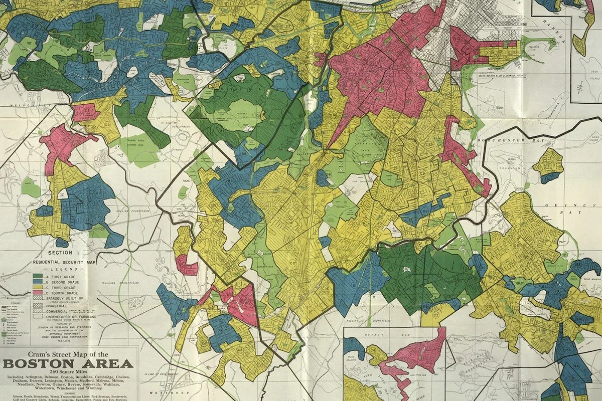
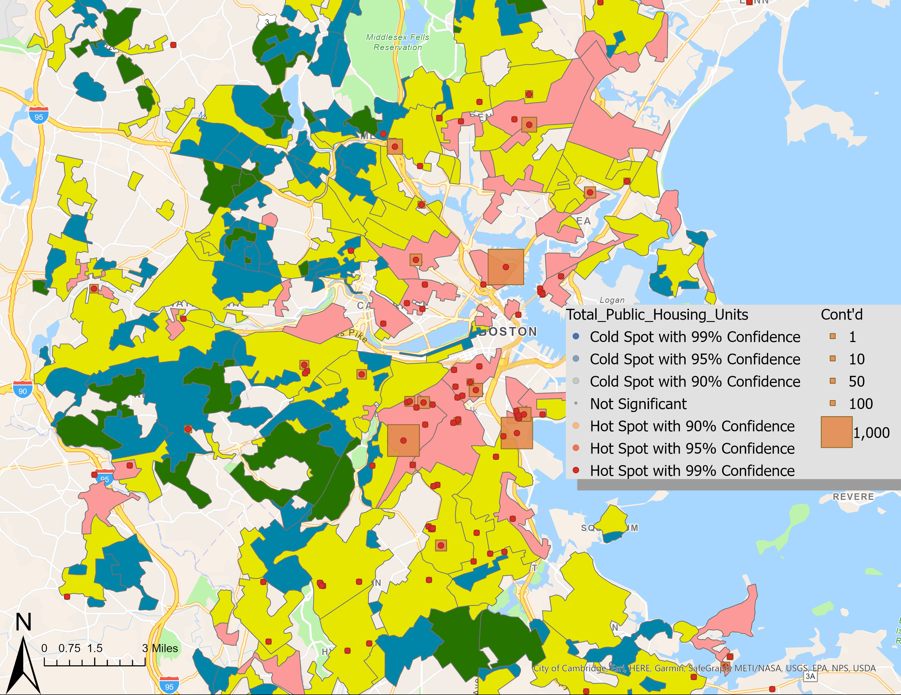

## Introduction

The goal of this research project is to explore the enduring impact of historical redlining maps created by the Home Owners Loan Corporation (HOLC) between 1935 and 1940 on the contemporary racial and ethnic population distribution within metropolitan areas. The central question guiding this investigation is: How do neighborhoods classified as "redlined" by HOLC in the past, often linked to communities of color, correlate with present-day patterns of racial and ethnic segregation? The hypothesis predicts that discriminatory lending practices and disinvestment in historically marginalized neighborhoods have led to persistent disparities in population composition, shaping the demographic landscape of these areas.

This hypothesis is grounded in the understanding that the repercussions of redlining extend far beyond its initial implementation, influencing the spatial distribution of racial and ethnic communities in metropolitan regions. The focal point of the study is the HOLC redlining status of neighborhoods during the historical period of 1935-1940. The outcome variable of interest is the current racial and ethnic composition within these areas, with a specific emphasis on location quotients (LQs) as small-area measures of segregation.

This research is interesting because it has the potential to provide an explanation for the social and economic disparities we see today. By examining the intersection of historical redlining practices and present-day demographic distributions, this research seeks to contribute valuable insights into the persistent consequences of discriminatory policies. The following sections delve into the empirical analysis, providing a comprehensive understanding of the relationship between HOLC redlining maps and contemporary racial and ethnic population dynamics within metropolitan areas.


Caption: HOLC Redlining Map of Greater Boston Area from between 1935-1940 retrieved from "Mapping Inequality" project created through the collaboration of three teams at four universities.


Caption: HOLC Redlining Map of Greater Boston Area compared to contemporary public housing units and their hotspots, showing greater amounts of public housing units in redlined neighborhoods, reflecting potential lasting disparities caused by historic redlining. Retrieved from Jeslyn Liu's final project for GOV 1008.

## Data Section

The dataset utilized in this study is a combination of data from historical records of redlining maps developed by the Home Owners Loan Corporation (HOLC) during the period spanning 1935-1940 and contemporary population and race/ethnicity data from the 2020 U.S. decennial census. The dataset includes key variables such as HOLC grade, demographic composition (specifically, the percentage of White, Black, Hispanic/Latino, Asian, and Other populations), and Location Quotients (LQs) across different ethnicities. The HOLC grade serves as the key independent variable, representing the historical redlining status of neighborhoods, while demographic composition and LQs act as dependent variables, shedding light on the enduring consequences of redlining practices on present-day population distributions and segregation.

The dependent variable of demographic composition is census data, which is measured through a systematic survey process that collects self-reported demographic information from individuals residing in households across the United States. The census captures the percentage of individuals identifying as White, Black, Hispanic/Latino, Asian, and Other, allowing for a detailed analysis of the racial and ethnic makeup within specific geographic zones. Additionally, the Location Quotients (LQs) for different ethnicities are calculated based on the census data. LQs serve as a statistical measure to assess the relative concentration or distribution of specific demographic groups within HOLC-graded areas in comparison to a broader reference area. The LQs are computed using a formula that takes into account the percentage of a particular ethnicity within a specific HOLC-graded zone and compares it to the overall percentage of that ethnicity in the larger metropolitan area. The key independent variable in this study, the HOLC grade, is derived from historical redlining maps created by the Home Owners Loan Corporation between 1935 and 1940. The measurement of the HOLC grade is not a direct outcome of a survey, statistical model, or expert coding. Instead, HOLC grades were determined through a combination of factors, including socioeconomic characteristics, racial and ethnic composition, and perceived stability of neighborhoods. HOLC officials often used subjective criteria and racial bias in their assessments, leading to discriminatory practices that disproportionately affected communities of color. 

Furthermore, the research design employed in this study is cross-sectional. A cross-sectional design involves collecting and analyzing data at a single point in time, providing a snapshot of the population or phenomenon under investigation. In this case, the data is drawn from the 2020 U.S. Decennial Census, capturing a comprehensive view of the racial and ethnic composition within metropolitan areas during that specific year. The primary objective is to explore the relationship between HOLC redlining grades from the historical period of 1935-1940 and the contemporary demographic distribution, using a single, extensive dataset.

The following plot provides a visual representation of the demographic composition within "Best Zones" (HOLC Grade A) and "Hazardous Zones" (HOLC Grade D). Each bar represents the percentage of a specific racial or ethnic group, allowing for a quick comparison of population distribution between historically privileged and disadvantaged zones. It is apparent from the graph that Black populations disproportionately live in "Hazardous Zones", being the population with the greatest proportion in areas with HOLC Grade D, whereas white populations live disproportionately in "Best Zones", being the demographic with the largest proportion in areas with HOLC Grade A. This visualization serves as a preliminary exploration of the main outcome of interest, offering an initial insight into how HOLC redlining practices may have influenced the contemporary demographic makeup of these areas. Further statistical analyses will delve into the nuances of these patterns and their implications for enduring racial and ethnic disparities within metropolitan regions.

```{r, summarizing dependent variable barplot}
library(tidyverse)

redlining <- read_csv("data.csv")

best_zones <- redlining |>
  filter(holc_grade == 'A')
hazardous_zones <- redlining |>
  filter(holc_grade == 'D')

categories <- c('White', 'Black', 'Hispanic/Latino', 'Asian', 'Other')

best_pct <- colMeans(best_zones
                     [c('pct_white', 'pct_black', 'pct_hisp', 'pct_asian', 'pct_other')], 
                     na.rm = TRUE)
hazardous_pct <- colMeans(hazardous_zones
                          [c('pct_white', 'pct_black', 'pct_hisp', 'pct_asian', 'pct_other')], 
                          na.rm = TRUE)

df <- data.frame(Category = categories, 'Best Zones' = best_pct, 
                 'Hazardous Zones' = hazardous_pct)

df <- df |> pivot_longer(cols = -Category, names_to = 'Zone Type', 
                         values_to = 'Percentage')

ggplot(df, aes(x = Category, y = Percentage, fill = fct_rev(`Zone Type`))) +
  geom_bar(stat = 'identity', position = 'fill') +
  labs(title = 'Population Distribution by Race/Ethnicity in "Best" and "Hazardous" Zones',
       x = 'Race/Ethnicity Categories', y = 'Proportion') +
  guides(fill = guide_legend(title = 'Zone Type'))
```
This plot sets the stage for a more in-depth examination of the relationships between HOLC grades and current population distributions, providing a visual foundation for subsequent analyses and interpretations in the following sections.

## Results

```{r, main analysis}
lq_data <- redlining |>
  select(metro_area, holc_grade, lq_white, lq_black, lq_hisp, lq_asian, lq_other) |>
  pivot_longer(cols = starts_with("lq"), names_to = 'Ethnicity', values_to = 'LQ')

ggplot(lq_data, aes(x = holc_grade, y = LQ, fill = Ethnicity)) +
  geom_boxplot() +
  labs(title = 'Location Quotient (LQ) Across HOLC Grades by Ethnicity',
       x = 'HOLC Grade',
       y = 'Location Quotient (LQ)',
       fill = 'Ethnicity')
```
In this data, an LQ greater than one indicates that a particular group is overrepresented in the specific area compared to the reference area. Naturally, an LQ less than one indicates that a particular group is underrepresented in the specific area compared to the reference area. Thus, "lq_white" being greater than one would indicate overrepresentation of the non-Hispanic white population in the HOLC zone compared to the surrounding area, "lq_black" being greater than one would indicate overrepresentation of the non-Hispanic Black population in the HOLC zone compared to the surrounding area, "lq_hisp" being greater than one would indicate overrepresentation of the Hispanic/Latino population, and so on. 

From our graph, we can see that the demographic with the highest median and overall LQ in areas with a HOLC Grade of A is the non-Hispanic white population. On the flip side, the demographic with the lowest median LQ and quartiles in areas with a HOLC Grade of A is the non-Hispanic Black population. This means that in areas with a HOLC Grade of A, the non-Hispanic white population is overrepresented compared to the surrounding area and the non-Hispanic Black population is largely underrepresented. 

On the opposite end, we can also see that in areas with a HOLC Grade of D, the non-Hispanic Black population is the most overrepresented by a larger margin. The non-Hispanic Asian and non-Hispanic white populations are the most underrepresented in these areas. 

This graph reveals disparities in the representation of different demographic groups in areas classified with different HOLC Grades. HOLC Grade A areas tend to show overrepresentation of the non-Hispanic white population and underrepresentation of the non-Hispanic Black population. In contrast, HOLC Grade D areas exhibit a significant overrepresentation of the non-Hispanic Black population and notable underrepresentation of the non-Hispanic Asian and non-Hispanic white populations. As a general trend, as the HOLC Grade gets lower, the non-Hispanic white and Asian populations get smaller while the Hispanic and non-Hispanic Black populations increase. These findings provide evidence indicating demographic disparities and lasting segregation in historically redlined areas.

```{r, regression output}
library(broom)
library(knitr)

# Tidy up the regression output
lq_data <- lq_data %>%
  mutate(sum_lq = rowSums(select(lq_data, starts_with("lq"))))

model <- lm(sum_lq ~ holc_grade, data = lq_data)
summary_table <- tidy(model)

# Format the output using kable
kable(summary_table, 
      col.names = c("Variable", "Coefficient", "Std. Error", "t-value", "p-value"),
      digits = 3)
```
The estimated coefficient for the main coefficient of interest holc_gradeD is 0.165. This suggests that, on average, the sum of Location Quotients (sum_lq) increases by approximately 0.165 units when the holc_grade is D compared to the reference category of hol_gradeA. The positive coefficient of 0.165 suggests a positive relationship between having a HOLC grade of D and an increase in the sum of Location Quotients. This means that areas classified as HOLC grade D tend to have, on average, a higher sum of Location Quotients compared to areas with HOLC grade A and the magnitude of 0.165 indicates the average change in the sum of Location Quotients associated with a one-unit change in the HOLC grade from A to D.

The small p-value (9.87e-11) indicates that the coefficient for holc_gradeD is statistically significant. This implies that the observed relationship between holc_gradeD and the sum of Location Quotients (sum_lq) is unlikely to be due to random chance. That being said, while the coefficient is statistically significant, establishing causation requires additional evidence, such as experimental design with randomized controlled trials and/or careful consideration of potential confounding factors. The coefficient may indicate a correlation/association between holc_gradeD and an increase in the sum of Location Quotients, but a causal interpretation should be made cautiously, as confounding factors, including factors such as bias in those who chose to fill out the census survey or other historical events that may have had lasting effects on the economic and demographic characteristics of areas with HOLC grade D, may be in play. Thus, identifying a causal effect would require further investigation.

## Conclusion

The observed patterns in the graphs align with the historical context of redlining, where Grade A areas were often associated with more affluent and predominantly white neighborhoods, while communities of color, particularly Black communities, were systematically excluded and faced disinvestment, ending up in areas with Grade D. The enduring impact of historical redlining is reflected in the contemporary spatial distribution of racial and ethnic populations within metropolitan areas. These findings support the research question by providing substantial support for the hypothesis that neighborhoods classified as "redlined" by HOLC in the 1930s exhibit enduring patterns of racial segregation and disparities in population composition within contemporary metropolitan areas. The disparities in LQs across HOLC Grades highlight the enduring consequences of historical redlining practices, contributing to the understanding of how discriminatory policies have shaped the demographic landscape in metropolitan areas over time. However, missing data and potential confounding factors, such as unobserved variables related to economic development or local policies, pose challenges to drawing definitive causal conclusions. Furthermore, the cross-sectional nature of the study also limits the ability to assess causal relationships. To enhance the analysis, future research could employ longitudinal data, consider additional confounding variables, and explore local and historical policy dynamics that may contribute to the observed patterns. Additionally, conducting sensitivity analyses and employing more advanced statistical techniques would further strengthen the robustness of the findings.


